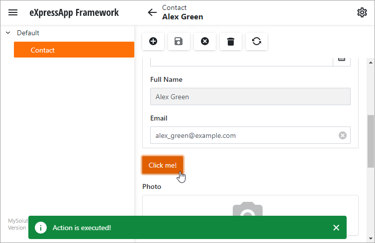

<!-- default file list -->
*Files to look at*:

* [ButtonRenderer.razor](./CS/MySolution.Module.Blazor/Editors/ButtonRenderer.razor)
* [ButtonModel.cs](./CS/MySolution.Module.Blazor/Editors/ButtonModel.cs)
* [ButtonDetailViewItemBlazor.cs](./CS/MySolution.Module.Blazor/Editors/ButtonDetailViewItemBlazor.cs)
<!-- default file list end -->

# How to: Use a Custom View Item to Add a Button to a Detail View

This example shows how to add a custom component to a Detail View. We add a button to a Detail View and display a message when a user clicks the button.

1. In the ASP.NET Core Blazor Module project, create a new [Razor component](https://docs.microsoft.com/en-us/aspnet/core/blazor/components/) and name it **ButtonRenderer**. In this component, configure the [DxButton](https://docs.devexpress.com/Blazor/DevExpress.Blazor.DxButton) component, add the **Create** method that creates @Microsoft.AspNetCore.Components.RenderFragment, and handle the **Click** event. 

   **Razor Component** - [./CS/MySolution.Module.Blazor/Editors/ButtonRenderer.razor](./CS/MySolution.Module.Blazor/Editors/ButtonRenderer.razor)
 
2. Ensure that the component's [Build Action](https://docs.microsoft.com/en-us/visualstudio/ide/build-actions) property is set to **Content**.

3. Create a ComponentModelBase descendant and name it _ButtonModel_. In this class, add properties and methods that describe your component.
   
   **Component Model** - [./CS/MySolution.Module.Blazor/Editors/ButtonModel.cs](./CS/MySolution.Module.Blazor/Editors/ButtonModel.cs)

4. In the ASP.NET Core Blazor Module project, create the **ButtonDetailViewItemBlazor** View Item and decorate it with the [ViewItemAttribute](https://docs.devexpress.com/eXpressAppFramework/DevExpress.ExpressApp.Editors.ViewItemAttribute) to make this View Item appear in the Application Model's **ViewItems** node.

5. Override the **CreateControlsCore** method to get a **ButtonHolder** instance. **ButtonHolder** returns a render fragment with our custom component. Note that in the XAF Blazor application, **CreateControlsCore** should return an instance that implements the **IComponentContentHolder** interface.

6. Override the **OnControlsCreated** method. In this method, subscribe to the component model’s **Click** event. Implement the logic in the **ComponentModel_Click** event handler (in our example, the [ShowMessage](https://docs.devexpress.com/eXpressAppFramework/DevExpress.ExpressApp.ShowViewStrategyBase.ShowMessage(System.String-DevExpress.ExpressApp.InformationType-System.Int32-DevExpress.ExpressApp.InformationPosition)) is called). 

7. Override the [BreakLinksToControls](https://docs.devexpress.com/eXpressAppFramework/DevExpress.ExpressApp.Editors.ListEditor.BreakLinksToControls) method. In this method, unsubscribe from the component model’s **Click** event to release resources.

   **Custom View Item** - [./CS/MySolution.Module.Blazor/Editors/ButtonDetailViewItemBlazor.cs](./CS/MySolution.Module.Blazor/Editors/ButtonDetailViewItemBlazor.cs).
   
   See the following help topic for more information: [How to: Use a Custom View Item to Add a Button to a Detail View](https://docs.devexpress.com/eXpressAppFramework/113653/ui-construction/view-items-and-property-editors/how-to-add-a-button-to-a-detail-view-using-custom-view-item)

   
