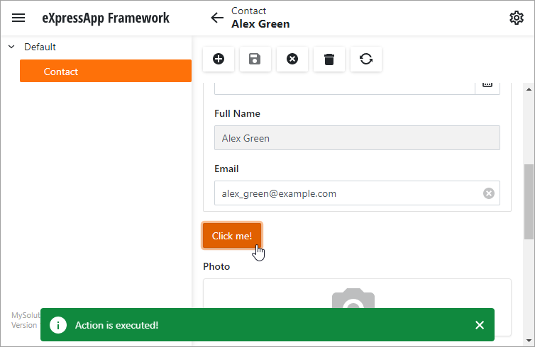

<!-- default badges list -->

<!-- default badges end -->
# XAF Blazor - Use a Custom View Item to Add a Button to a Detail View

This example shows how to add a custom component to a Detail View. We add a button to a Detail View and display a message when a user clicks the button.

For detailed instructions, refer to the following topic: [How to Add an Unbound Control (Button) to the Form Layout in an XAF View (with a Fully Custom ViewItem)](https://docs.devexpress.com/eXpressAppFramework/113653/ui-construction/view-items-and-property-editors/add-a-button-to-a-detail-view-using-custom-view-item).

## Files to Look at

* [Button.razor](./CS/EFCore/CustomViewItem/CustomViewItem.Blazor.Server/Editors/ButtonViewItem/Button.razor)
* [ButtonModel.cs](./CS/EFCore/CustomViewItem/CustomViewItem.Blazor.Server/Editors/ButtonViewItem/ButtonModel.cs)
* [ButtonDetailViewItemBlazor.cs](./CS/EFCore/CustomViewItem/CustomViewItem.Blazor.Server/Editors/ButtonViewItem/ButtonDetailViewItemBlazor.cs)
<!-- default file list end -->

## Documentation

* [Using a Custom Control that is not Integrated by Default](https://docs.devexpress.com/eXpressAppFramework/113610/ui-construction/using-a-custom-control-that-is-not-integrated-by-default)
* [How to: Implement a View Item](https://docs.devexpress.com/eXpressAppFramework/405483/ui-construction/view-items-and-property-editors/add-an-unbound-control-button-to-the-form-layout-in-an-xaf-view)

## More Examples

[XAF WinForms - Add an Unbound Control (Button) to the Form Layout in an XAF View (with a Fully Custom ViewItem)](https://github.com/DevExpress-Examples/xaf-win-add-custom-button-to-form-using-custom-view-item)
<!-- feedback -->
## Does this example address your development requirements/objectives?

 

(you will be redirected to DevExpress.com to submit your response)
<!-- feedback end -->
